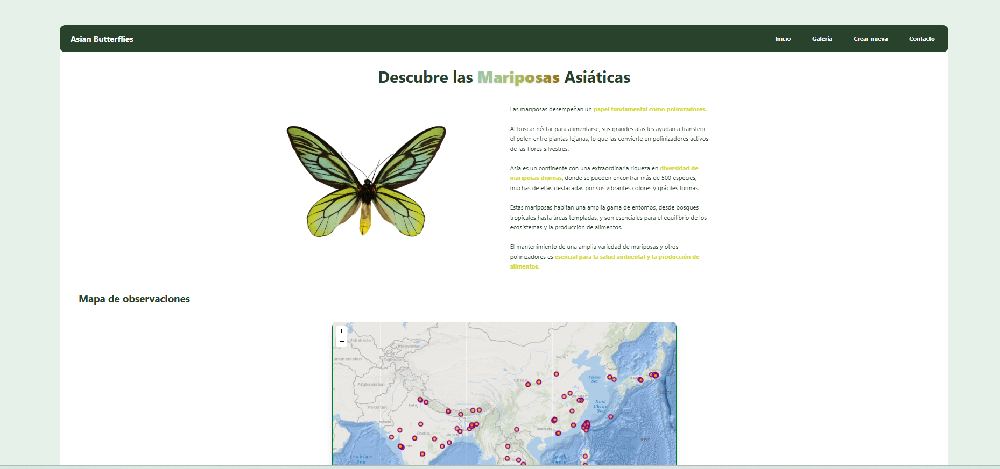
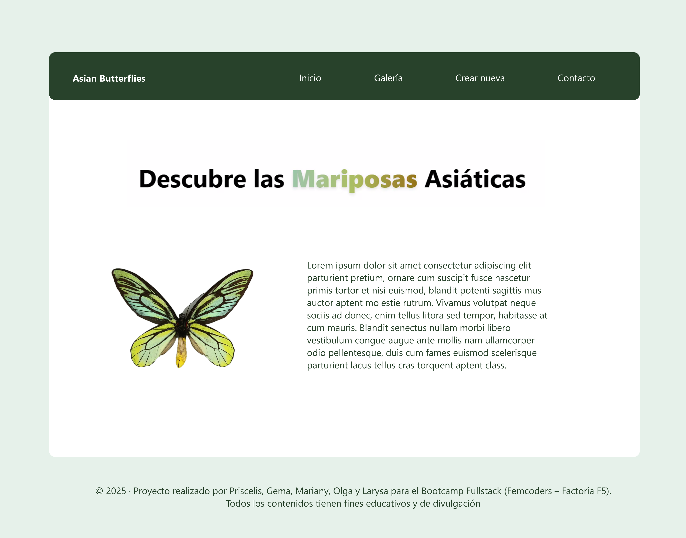
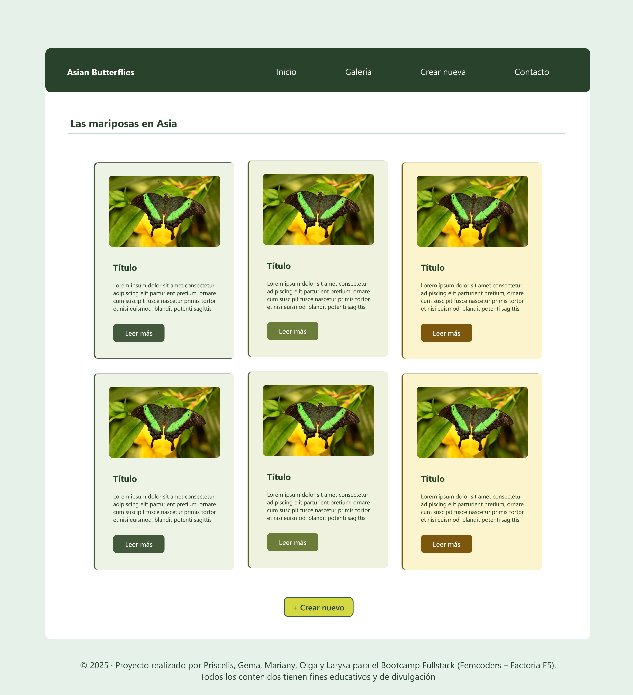
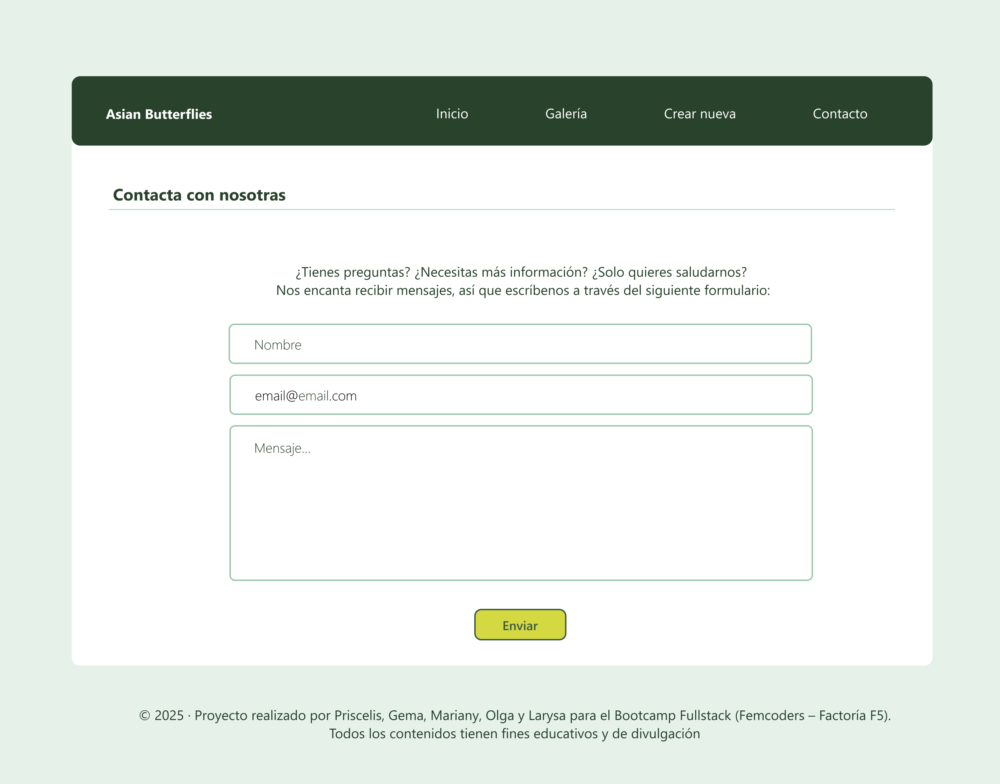
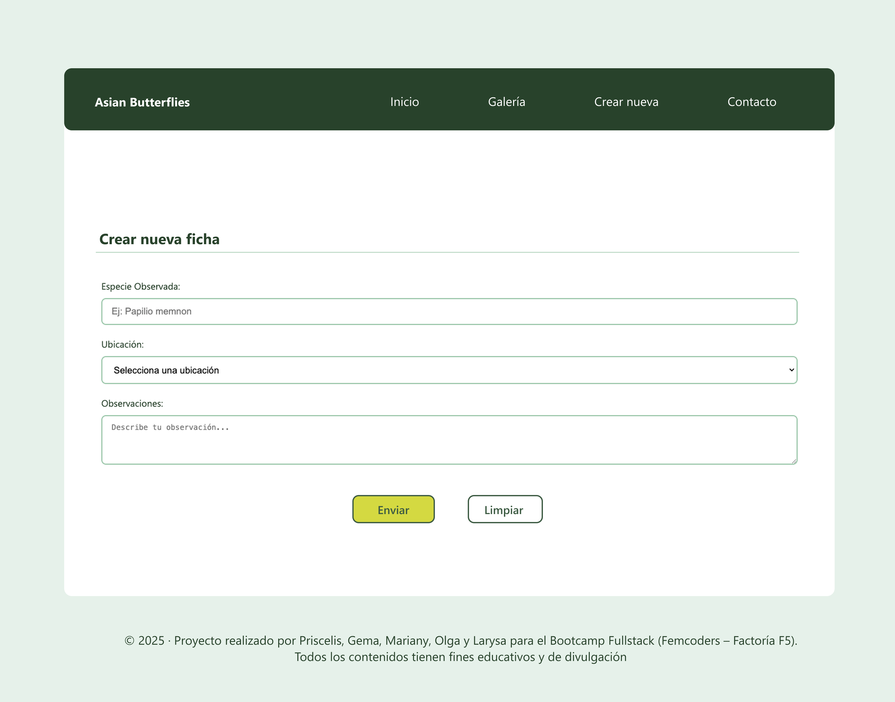
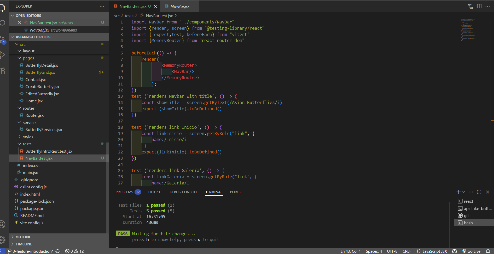

# 🦋 Asian Butterflies

Aplicación web educativa sobre el papel vital de los polinizadores — especialmente las mariposas asiáticas — en la conservación de la biodiversidad. Desarrollada para concienciar sobre las amenazas que enfrentan y cómo podemos protegerlos con pequeñas acciones cotidianas.

---

## 🐝 Descripción



Una aplicación sencilla para crear conciencia sobre uno de los grupos más vitales —pero amenazados— de nuestro ecosistema: los polinizadores.

Aunque son pequeños, los polinizadores como abejas, mariposas, murciélagos y aves realizan una de las tareas más importantes de la naturaleza: transportar el polen, garantizando la reproducción de las plantas y la estabilidad de los ecosistemas.

El proyecto se enfoca en las mariposas de Asia, polinizadoras diurnas y crepusculares que complementan el trabajo de abejas. Muchas están en peligro por el cambio climático, pesticidas y pérdida de hábitat.

🌸 Conoce a estas especies asombrosas y descubre cómo puedes protegerlas:
- Plantando flores nativas
- Evitando químicos
- Conservando hábitats naturales

---

## ⚡ Características

- 🌐 Navbar reutilizable con navegación responsive (hamburger menu)
- 🧩 Sistema completo de botones con variantes, estados y tamaños
- 🦋 Sección "Introducción" con imagen, animaciones y diseño responsive
- 🖼️ Componente `ImageWithText` con lazy loading
- 📝 Componentes de texto reutilizables con tipografía consistente
- 🧬 `ButterflyCard` con imagen, botón, animaciones y responsividad
- 📊 `ButterflyGrid` con estados loading/error y botón “Crear nueva”
- 🔍 Filtros por región, especie, estado y búsqueda
- 🔁 Scroll infinito / paginación
- 🧾 Formularios con validación (`CreateButterflyForm`, `ContactForm`)
- ⚠️ Alertas interactivas con animaciones
- 🔖 Badges para estado de conservación
- 📎 Footer con créditos, enlaces y diseño adaptativo
- 🧪 Testing básico de componentes principales

---

## 🎨 Diseño

El diseño visual del proyecto está basado en un prototipo de Figma que define estética, colores y experiencia de usuario.







### 🎨 Paleta de colores

#### 🌿 Gama Mint Green

- **Mint Green 100** `#C1DCCA` — fondo claro, aireado  
- **Mint Green 300** `#83AB90` — para tarjetas o secciones secundarias  
- **Mint Green 500** `#53745B` — botones y elementos destacados  
- **Mint Green 700** `#28422B` — encabezados, alto contraste  

#### ☀️ Mustard Yellow 300 `#D3B01D`

Amarillo cálido para íconos de acción, botones y llamados visuales.

### ✍️ Tipografía

- **Segoe UI**

---

## 🛠️ Tech Stack

- **React** — biblioteca principal para UI
- **React Router DOM** — navegación entre vistas
- **Vite** — herramienta de build ultrarrápida
- **JSX** — sintaxis para componentes
- **Tailwind CSS** — estilo utilitario y moderno
- **JSON Server** — backend simulado para CRUD (db.json)
- **Node.js & npm** — entorno de ejecución

---

## ⚙️ Instalación

### 📋 Prerrequisitos

- Node.js v16+
- npm

### 🔧 Setup

```bash
git clone https://github.com/TU_USUARIO/asian-butterflies.git
cd asian-butterflies
npm install

npm run api-fake     # iniciar JSON Server en http://localhost:3000
npm run dev     # iniciar app React en http://localhost:5173
```
---

🗂️ Estructura de archivos
```bash
/public           # assets estáticos
/server
  └── db.json     # backend simulado

/src
  ├── /assets     # imágenes y sonidos
  ├── /components # componentes reutilizables (Navbar, Card, etc.)
  ├── /layout     # estructura general (Navbar + Footer)
  ├── /pages      # vistas principales (Home, Galería, Contacto)
  ├── /router     # rutas de navegación
  ├── /forms      # formularios y validaciones
  └── main.jsx    # punto de entrada
```
---

## 🧪 Testing 


- Todos los enlaces del menú (**Inicio**, **Galería**, etc.) funcionan correctamente.
- Cada enlace redirige a la sección correspondiente sin errores.
- La navegación es fluida y responsiva en distintos dispositivos.
- La experiencia del usuario es coherente y sin interrupciones.

---

## 🏗️ Planes 
### 🦋 Hero Section

- Crear sección **Hero** antes de la Introducción
- Imagen de fondo con mariposa
- Título principal y botón CTA
- Efecto **parallax** o animaciones avanzadas para una experiencia inmersiva

### 🧪 Componente `FilterBar`

- Filtros por:
  - Región
  - Especie
  - Estado de conservación
- Búsqueda por texto
- Botón para **limpiar filtros**
- Integración directa con el grid de mariposas

### 🔘 Agrupación de botones

- Crear componente reutilizable para botones agrupados
- Espaciado y alineación consistentes
- Diseño responsive en móvil (stack vertical)

### 🦋 Animaciones extra

- Implementar animación para que las mariposas **vuelen libremente por la pantalla** 🌬️

---
## 👩‍💻 Desarrolladoras
[Priscelis](https://www.linkedin.com/in/priscelis-codrington-5195b0206) - Scrum Master / Developer

[Gema](https://www.linkedin.com/in/gema-y%C3%A9benes-caballero-83b6a6100/) - Product Owner / Developer

[Mariany](https://www.linkedin.com/in/mariany-araujo/) - Developer

[Olga](https://www.linkedin.com/in/olga-ramirez-rodriguez/) - Developer

[Larysa](https://www.linkedin.com/in/larysa-ambartsumian/) - Developer
